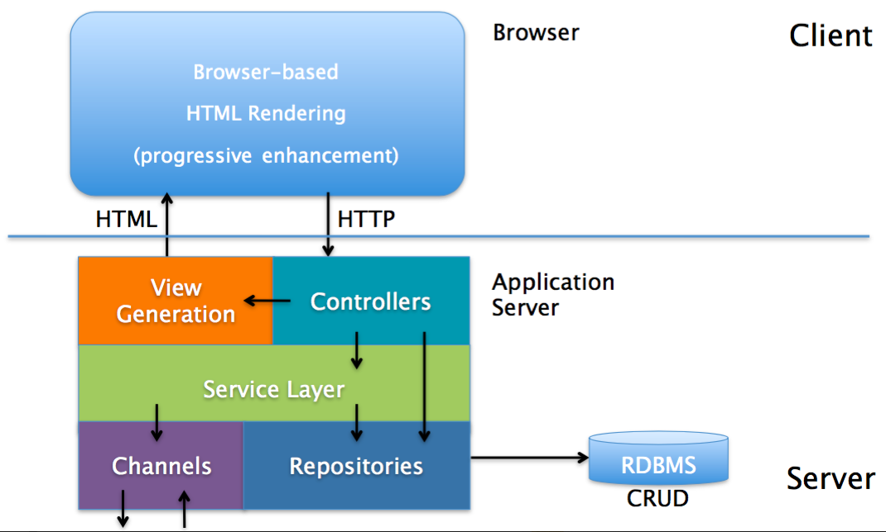

# Spring Boot x Doma 2 x PostgreSQL x Thymeleaf

## 問題1: 2016年2月29日の火星の天気を教えてください

* 解答: [http://localhost/view?date=2016/02/29](http://localhost/view?date=2016/02/29)

## 問題2: 2016年2月1日〜2016年2月29日の火星の天気を教えてください

* 解答: [http://localhost/view?date_from=2016/02/01&date_to=2016/02/29](http://localhost/view?date_from=2016/02/01&date_to=2016/02/29)

## 問題3: 2015年の火星の平均最高気温を教えてください

* 解答: [http://localhost/view?avg_temp=20150101-20151231](http://localhost/view?avg_temp=20150101-20151231)

## 問題4: 2015年の火星の最低気温と日付を教えてください

* 解答: [http://localhost/view?min_temp_day=20150101-20151231](http://localhost/view?min_temp_day=20150101-20151231)

## Big Picture




## Web アプリケーションの構成

* フロントエンド
  * Thymeleaf (HTML)
* バックエンド
  * Web アプリケーション フレームワーク
    * Spring Boot (Java)
  * データベース
    * PostgreSQL (SQL)
  * O/R マッパー (O/RM)
    * Doma 2 (Java)
* バージョン コントロール システム (VCS)
  * Git
  * GitHub
* ビルド ツール
  * Maven (XML)

## ファイル構成

```bash
pom.xml
├── java
│   └── com
│       └── github
│           └── marsweather
│               ├── Application.java
│               ├── controller
│               │   ├── MarsApiRestController.java
│               │   └── MarsApiViewController.java
│               └── domain
│                   ├── entity
│                   │   └── DReport.java
│                   ├── repository
│                   │   └── ReportRepository.java
│                   └── service
│                       └── ReportService.java
└── resources
    ├── META-INF
    │   └── com
    │       └── github
    │           └── marsweather
    │               └── domain
    │                   └── repository
    │                       └── ReportRepository
    │                           ├── selectAll.sql
    │                           └── selectByTerrestrialDate.sql
    ├── application.properties
    ├── schema.sql
    └── templates
        └── view.html
```

| ファイル名                   | 技術要素                   | 言語  | 説明  |
|-----------------------------|--------------------------|-------|------|
| pom.xml                     | Maven                    | XML   | プロジェクトに必要なパッケージの依存関係を設定する  |
| application.properties      | Spring Boot              | Java  | Spring Boot, Doma 2 のデータベース接続先を設定する  |
| schema.sql                  | Spring Boot, PostgreSQL  | SQL   | Spring Boot 起動時に実行される SQL。データベースにテーブルを作成する  |
| Application.java            | Spring Boot              | Java  | Spring Boot を起動する  |
| MarsApiViewController.java  | Spring Boot              | Java  | ブラウザに入力された URL に処理を紐付ける  |
| ReportService.java          | Spring Boot              | Java  | データベースのトランザクションを制御する  |
| ReportRepository.java       | Spring Boot, Doma 2      | Java  | データベースに CRUD する |
| DReport.java                | Doma 2                   | Java  | データベースから読み書きする結果を格納する  |
| selectByTerrestrialDate.sql | Doma 2, PostgreSQL       | SQL   | PostgreSQL の 検索 SQL |
| view.html                   | Thymeleaf                | HTML  | 画面  |


## Web
* [http://localhost:8080/view](http://localhost:8080/view)
* [http://localhost:8080/view?date=2016/03/07](http://localhost:8080/view?date=2016/03/07)

## REST
* [http://localhost:8080/rest](http://localhost:8080/rest)
* [http://localhost:8080/rest?date=2016/03/07](http://localhost:8080/rest?date=2016/03/07)

# 参考ノート
1. BLOG.IK.AM, 「Spring Boot + Doma2を使おう」, https://blog.ik.am/entries/371
1. Qiita, 「Spring Boot + Doma2で2WaySQLを使うまで」, http://qiita.com/ARS_2000/items/4c680ec9b31725687e04
1. Qiita, 「Spring Boot 使い方メモ」, http://qiita.com/opengl-8080/items/05d9490d6f0544e2351a
1. Spring Boot Reference Guide, http://docs.spring.io/spring-boot/docs/current/reference/htmlsingle/
1. Doma 2 User Documentation, http://doma.readthedocs.org/ja/stable/
1. Tutorial: Using Thymeleaf (ja), http://www.thymeleaf.org/doc/tutorials/2.1/usingthymeleaf_ja.html
